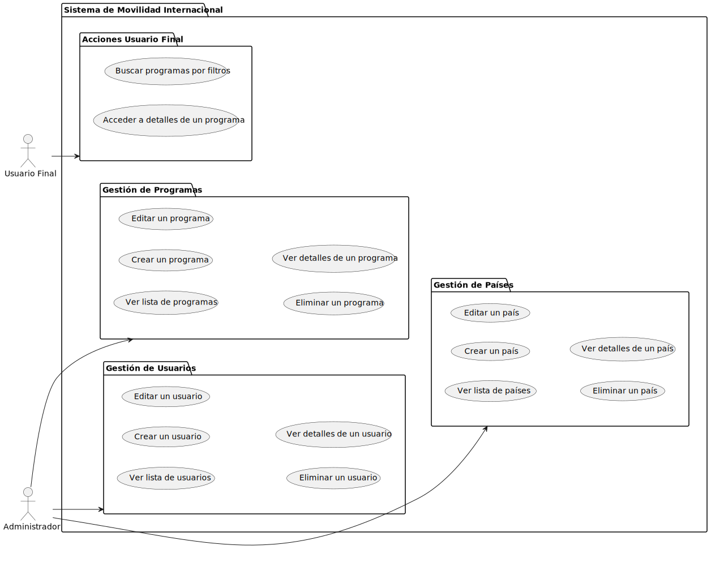

# Sistema de Movilidad Internacional

Este proyecto es una aplicación web integral diseñada para administrar programas internacionales de movilidad, usuarios y países asociados. Incluye funcionalidades tanto del lado del servidor (**backend**) como del cliente (**frontend**).

## 📦 Estructura del Proyecto

```
.
├── backend/          # API y lógica del servidor
├── frontend/         # Interfaz de usuario (React + Next.js)
└── README.md         # Documentación general
```

---

## 🛠 [Backend](./backend/README.md)

### Descripción
El backend está desarrollado en **Node.js** y **TypeScript**, utilizando **Mongoose** como ORM para MongoDB. Proporciona una **API RESTful** que incluye autenticación, gestión de programas, usuarios y países.

### Principales Características
- **Autenticación JWT**: Manejo de tokens seguros.
- **CRUD de Programas**: Creación, lectura, actualización y eliminación de programas.
- **Gestión de Usuarios**: Operaciones para la administración de usuarios y participantes.
- **Gestión de Países**: Mantiene información de los países disponibles.
- **Validación de datos**: A través de **Zod**.

### Estructura del Backend
```
backend/
├── src/
│   ├── config/           # Configuraciones (DB, servidor, etc.)
│   ├── controllers/      # Controladores para rutas
│   ├── models/           # Modelos de la base de datos (Mongoose)
│   ├── routes/           # Rutas del servidor
│   ├── services/         # Lógica de negocio
│   └── schemas/          # Validación de datos con Zod
├── app.ts                # Configuración principal de la app
└── server.ts             # Inicia el servidor
```

### Dependencias Clave
- `express` - Framework de servidor.
- `mongoose` - Modelado de datos para MongoDB.
- `zod` - Validación de datos.
- `jsonwebtoken` - Manejo de JWT.
- `axios` - Cliente HTTP.

---

## 💻 [Frontend](./frontend/README.md)

### Descripción
El frontend está desarrollado con **React** y **Next.js**, utilizando **TypeScript**. Implementa una interfaz limpia y responsiva usando **Tailwind CSS** y **Material UI**.

### Funcionalidades Principales
1. **Autenticación**:
   - Login con manejo de tokens JWT.
2. **Administrador**:
   - **Listado de Programas**: Vista con filtros avanzados y paginación.
   - **Detalle del Programa**: Visualización de información detallada.
   - **Gestión de Programas**: Creación, edición y eliminación.
   - **Gestión de Usuarios**: Manejo de participantes y administradores.
   - **Gestión de Países**: Listado y administración de países.
3. **Filtros Avanzados**:
   - Búsqueda por nombre, país, estado y fechas.
4. **Componentes Reutilizables**:
   - Tablas (`Table.tsx`).
   - Formularios (`ProgramForm.tsx`).
   - Barra de navegación (`Sidenav.tsx`).

### Estructura del Frontend
```
frontend/
├── src/
│   ├── components/       # Componentes reutilizables
│   ├── services/         # Llamadas a la API (axios)
│   ├── constants/        # Constantes compartidas
│   ├── interfaces/       # Tipos TypeScript
│   ├── pages/            # Páginas de la aplicación
│   └── styles/           # Estilos globales (Tailwind)
├── public/               # Archivos estáticos
└── package.json          # Configuración de dependencias
```

### Dependencias Clave
- `next` - Framework React para SSR.
- `react` - Librería base para UI.
- `tailwindcss` - Framework de estilos CSS.
- `@mui/material` - Componentes de Material UI.
- `axios` - Cliente HTTP.
- `zustand` - Manejo de estado global.

---

## 🚀 Instalación y Ejecución

### 1. Clonar el repositorio
```bash
git clone https://github.com/usuario/sistema-movilidad.git
cd sistema-movilidad
```

### 2. Backend
1. Instalar dependencias:
   ```bash
   cd backend
   npm install
   ```
2. Configurar variables de entorno (`.env`):
   ```env
   MONGO_URI=tu_mongodb_uri
   JWT_SECRET=tu_secreto_jwt
   PORT=5000
   ```
3. Iniciar servidor:
   ```bash
   npm run dev
   ```

### 3. Frontend
1. Instalar dependencias:
   ```bash
   cd frontend
   npm install
   ```
2. Iniciar servidor de desarrollo:
   ```bash
   npm run dev
   ```
3. Acceder a la aplicación:
   - [http://localhost:3000](http://localhost:3000)

---

## 🔧 Scripts Disponibles

### Backend
- `npm run dev` - Inicia el servidor en modo desarrollo.
- `npm run build` - Compila el proyecto.

### Frontend
- `npm run dev` - Inicia el servidor Next.js en desarrollo.
- `npm run build` - Compila la aplicación.
- `npm start` - Ejecuta la aplicación compilada.

---
## Diagramas
### Front

### Funcionamiento general


---


## 📝 Contribuciones
Las contribuciones son bienvenidas. Por favor, abre un **Issue** o un **Pull Request** para sugerencias o cambios.

---

## 📄 Licencia
Este proyecto está bajo la licencia **MIT**.

