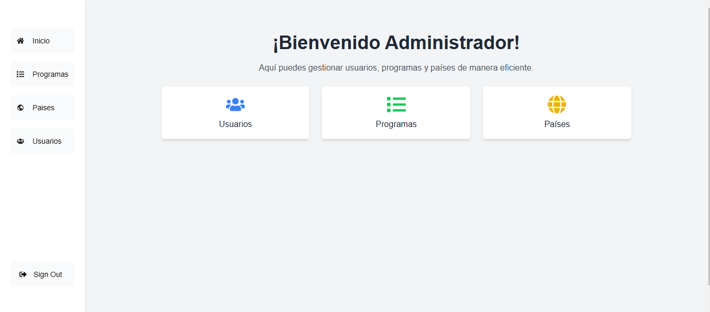
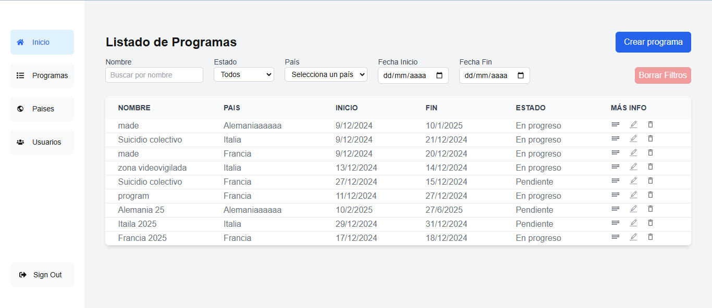
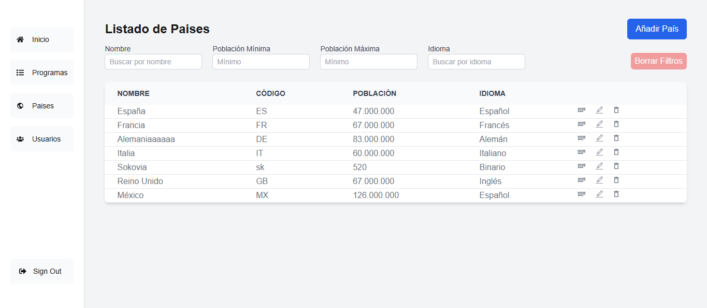
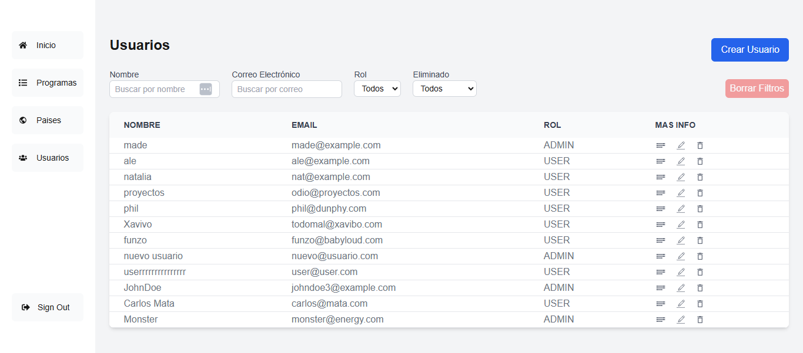
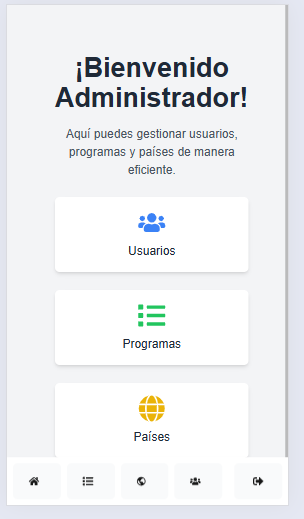
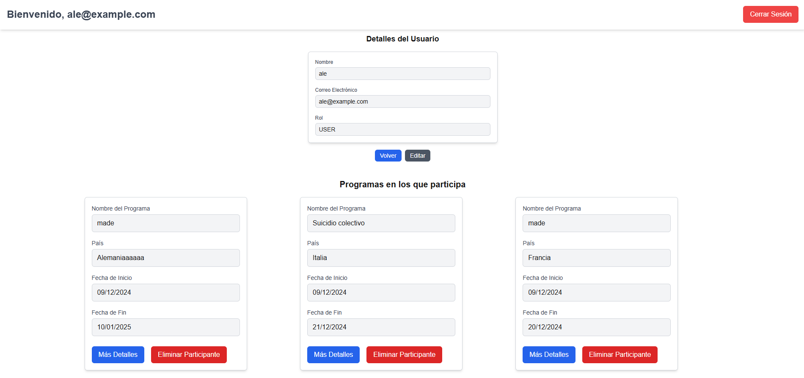

# Sistema de Movilidad Internacional - Frontend 📋

Este README documenta cada una de las vistas del frontend del proyecto **Sistema de Movilidad Internacional**. Cada sección incluye una breve descripción de la funcionalidad y una referencia a su estructura de código.

---

## 📜 **Índice**
1. [Vista de Inicio](#vista-de-inicio)
2. [Vista de Listado de Programas](#vista-de-listado-de-programas)
3. [Vista de Listado de Países](#vista-de-listado-de-paises)
4. [Vista de Listado de Usuarios](#vista-de-listado-de-usuarios)
5. [Vista de Detalles de Programa](#vista-de-detalles-de-programa)
6. [Vista de Formulario de Programas](#vista-de-formulario-de-programas)
7. [Navbar Responsivo](#navbar-responsivo)
8. [Vista de Administrador](#vista-de-administrador)
9. [Roles de Usuario](#roles-de-usuario)

---

## 🏠 **Vista de Inicio**
- **Descripción**: Página principal que da la bienvenida al administrador del sistema.
- **Funcionalidad**:
  - Mensaje de bienvenida personalizado.
  - Enlaces rápidos a las secciones: Usuarios, Programas y Países.
- **Archivo**: `src/pages/admin/index.tsx`

---

## 📋 **Vista de Listado de Programas**
- **Descripción**: Muestra un listado de todos los programas disponibles con opciones de búsqueda y filtrado.
- **Funcionalidad**:
  - Búsqueda por nombre, estado, país y rango de fechas.
  - Visualización de los programas en una tabla ordenada.
  - Acciones disponibles: Editar, Eliminar y Detalles.
- **Archivos**:
  - **Componente principal**: `src/components/ProgramsTable.tsx`
  - **Contenido de la tabla**: `src/components/ProgramsTableContent.tsx`
  - **Barra de filtros**: `src/components/ProgramFiltersToolbar.tsx`

---

## 🌍 **Vista de Listado de Países**
- **Descripción**: Permite al administrador gestionar la información de países.
- **Funcionalidad**:
  - Filtrado por nombre, población e idioma.
  - Opciones de edición y eliminación de países.
- **Archivos**:
  - **Tabla principal**: `src/components/Table.tsx`
  - **Datos de países**: `src/pages/admin/countries.tsx`

---

## 👤 **Vista de Listado de Usuarios**
- **Descripción**: Permite la gestión de usuarios dentro del sistema.
- **Funcionalidad**:
  - Búsqueda por nombre y correo electrónico.
  - Filtrado por roles.
  - Acciones disponibles: Editar, Eliminar y Más Información.
- **Archivos**:
  - **Componente principal**: `src/components/Table.tsx`
  - **Datos de usuarios**: `src/pages/admin/users.tsx`

---

## 📄 **Vista de Detalles de Programa**
- **Descripción**: Proporciona información detallada sobre un programa específico.
- **Funcionalidad**:
  - Visualización del nombre, país, fechas, estado y participantes del programa.
  - Opciones: Volver y Editar.
- **Archivo**: `src/components/ProgramDetails.tsx`

---

## 📝 **Vista de Formulario de Programas**
- **Descripción**: Formulario para crear o editar programas.
- **Funcionalidad**:
  - Validación de campos con **Zod**.
  - Campos disponibles: Nombre, País, Participantes, Fecha de Inicio y Fecha de Fin.
  - Envío de datos al servidor.
- **Archivos**:
  - **Componente principal**: `src/components/ProgramForm.tsx`
  - **Select de participantes**: `src/components/ParticipantAutocomplete.tsx`

---

## 📌 **Navbar Responsivo**
- **Descripción**: Barra de navegación adaptable a dispositivos pequeños y grandes.
- **Funcionalidad**:
  - En pantallas pequeñas: Navbar **abajo** con diseño horizontal.
  - En pantallas grandes: Navbar **al lado izquierdo** con diseño vertical.
  - Botón de "Sign Out" para cerrar sesión.
- **Archivo**: `src/components/Sidenav.tsx`

---

## 🛠️ **Vista de Administrador**
- **Descripción**: Página principal para el administrador con enlaces rápidos a las secciones del sistema.
- **Funcionalidad**:
  - Bienvenida al administrador.
  - Tarjetas con accesos directos a: Usuarios, Programas y Países.
- **Archivo**: `src/pages/admin/page.tsx`

---
## 🛠️ **Vista de Usuario**
- **Descripción**: Página principal para el Usuario con informacion sobre el y los programas a los que esta inscrito.
- **Funcionalidad**:
  - Acceder a la informacion detallada de cada pais y programa al que esta apuntado.
- **Archivo**: `src/pages/users/page.tsx`

---

📈 **Con esta documentación puedes organizar y entender las vistas principales del frontend del Sistema de Movilidad Internacional.**

